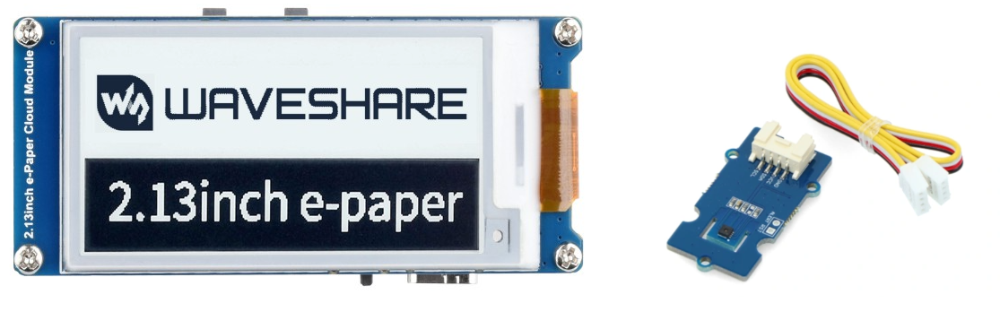
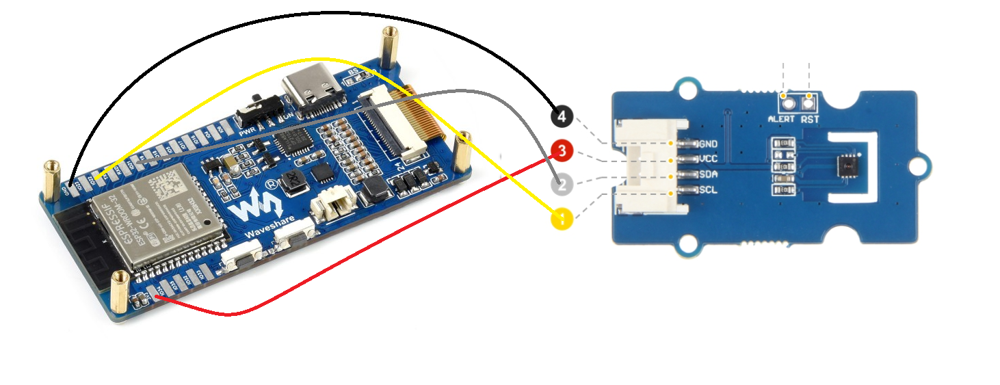
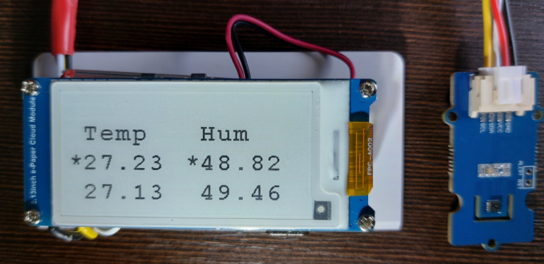

# Esp32_epaper_thermometer

## Hardware used:
- 2.13inch E-Paper Cloud Module, 250×122, WiFi Connectivity : https://www.waveshare.com/2.13inch-e-paper-cloud-module.htm
- Grove - I2C High Accuracy Temp&Humi Sensor(SHT35) : https://wiki.seeedstudio.com/Grove-I2C_High_Accuracy_Temp%26Humi_Sensor-SHT35/

## Wiring
Since E-Paper Cloud Module contains integrated ESP32, wiring is  pretty easy.  

Please note, that Esp32 you have to solder wires to E32 chip on E-Paper board, since it does not have golden pins socket  

## Required libraries sources:
- 2.13inch e-Paper Cloud Module : https://www.waveshare.com/wiki/2.13inch_e-Paper_Cloud_Module
- Temperature sensor STH35: https://github.com/Seeed-Studio/Seeed_SHT35

## Project features
- High precision temperature sensor SHT35 is used with precision 0.1 - 0.2 °C
- Very low power consumption, sleep mode of ESP32 is used
- Display layout can be easily changed. In this example two readings are shown : current reading (marked with asterisk symbol) and previous one shown in a row below.
- Temperature and humidity readings are made every 10 seconds, it could be changed to any other value according to our needs
- ESP32 features WIFI connection capabilities. This could be added to a project.

## Final effect

