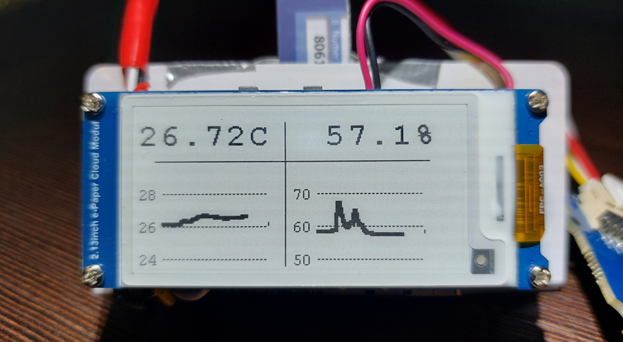

# E-paper thermometer
### There were several goals for this project, distinguishing it from many similar temperature measuring designs:
- good visibility, but with low power consumption. E-paper displays are hard to beat in this regard,
since they have better contrast than LCD and consume power only when refreshed. This make them ideal choice for this kind of applications.
- high measurement accuracy. For that reason I chose sensor based on STH35 from Sensirion,
- since it offers very high precision (about 0.1 °C) (https://sensirion.com/media/documents/213E6A3B/63A5A569/Datasheet_SHT3x_DIS.pdf)
Of course cheaper alternative can be used if we can accept lower accuracy. 
For example DTH22, which I used in my another project https://www.waveshare.com/dht22-temperature-humidity-sensor.htm

### Comparison between two of my projects using STH35 and DTH22 sensors. 
In room temperature difference between them is in most cases in 0.1 - 0.3 °C range,
which is very good result (I don't have professional thermometer for better comparison). Humidity precision seems also be ok.  

## Hardware used:
- 2.13inch E-Paper Cloud Module, 250×122, WiFi Connectivity : https://www.waveshare.com/2.13inch-e-paper-cloud-module.htm
- Grove - I2C High Accuracy Temp&Humi Sensor(SHT35) : https://wiki.seeedstudio.com/Grove-I2C_High_Accuracy_Temp%26Humi_Sensor-SHT35/

## Wiring
Since E-Paper Cloud Module contains integrated ESP32, wiring is  pretty easy.  

Please note, that in case of this board, you will have to solder wires to ESP32 chip, since this board does not have gold pins, or even an option to mount them.  

## Required libraries sources:
- 2.13inch e-Paper Cloud Module : https://www.waveshare.com/wiki/2.13inch_e-Paper_Cloud_Module
- Temperature sensor STH35: https://github.com/Seeed-Studio/Seeed_SHT35

## Project features
- High precision temperature sensor SHT35 is used with precision 0.1 - 0.2 °C
- 2.13inch E-Paper Cloud Module has ESP32 chip and attached battery. The final package is light and small. 
Could be used without external power source. Also could be powered and charged via usb-c without any additional circuits  
- Very low power consumption, light sleep mode of ESP32 is used. 
- Partial screen refresh function is used. Screen does not flicker, like it does when full refresh is made. 
Other sleep modes (e.g. deep sleep) could be used as well reducing power consumption even more (however I did not manage to avoid screen refreshes after deep sleep wake up).
- Display layout can be easily changed. In this example two readings are shown: current reading (marked with asterisk symbol) and previous one shown in a row below.
- Temperature and humidity readings are made every 10 seconds, it could be changed to any other value according to our needs
- ESP32 features WIFI connection capabilities. This could be added to a project using ESP32 libraries.

## Final effect

### Simple version of code using built-in fonts : [esp32_epaper_temp_hum.ino](esp32_epaper_temp_hum/esp32_epaper_temp_hum.ino)

### Presenting charts: [esp32_epaper_temp_hum_chart.ino](esp32_epaper_temp_hum_chart/esp32_epaper_temp_hum_chart.ino)

### Using custom big digit fonts: [esp32_epaper_temp_hum_big_digits.ino](esp32_epaper_temp_hum_big_digits/esp32_epaper_temp_hum_big_digits.ino)

Temperature and humidity are shown one after the other. First humidity, then there is 2 seconds delay,
temperature is shown next, following with sleep for 10 seconds. This way power consumption is minimalized.

